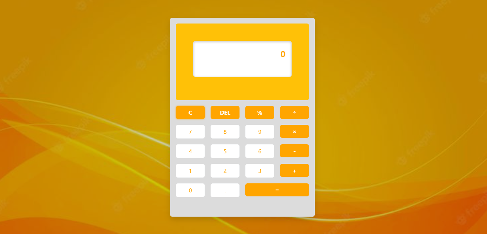

# Scientific Calculator Web Application

A simple and beautiful calculator with a modern UI. Built using:

- HTML
- CSS
- Bootstrap 5
- JavaScript

## Features

- Supports basic operations: `+`, `-`, `×`, `÷`, `%`, `.`
- Clear (`C`) and Delete (`DEL`) functions
- Responsive and mobile-friendly layout
- Background image with dark overlay for readability

## Screenshot

---

Happy Calculating!

